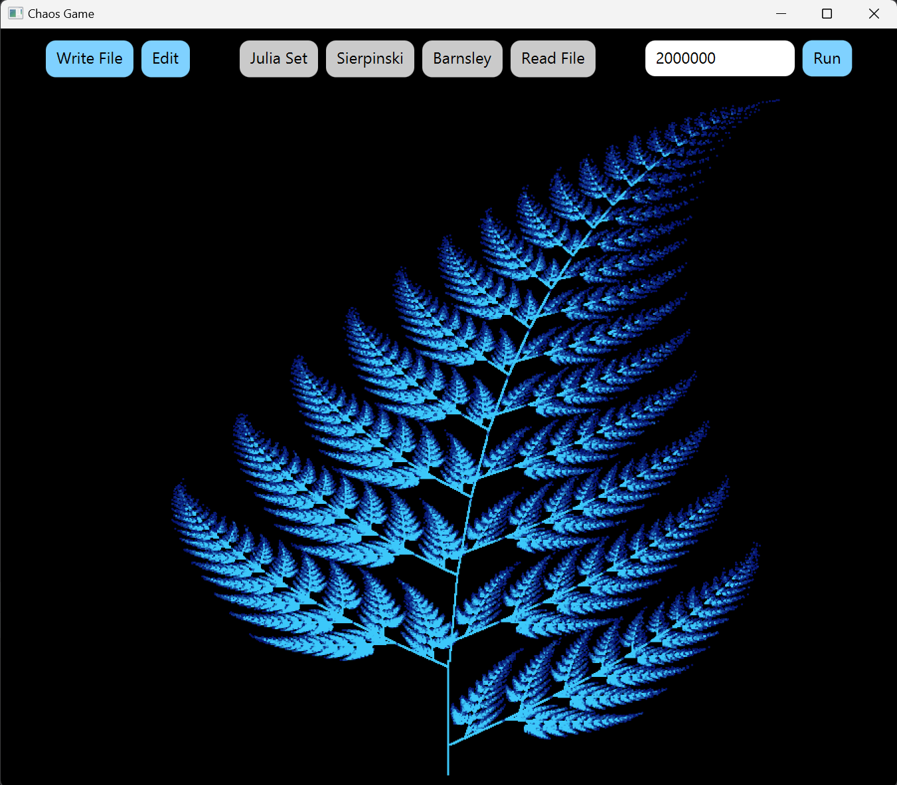
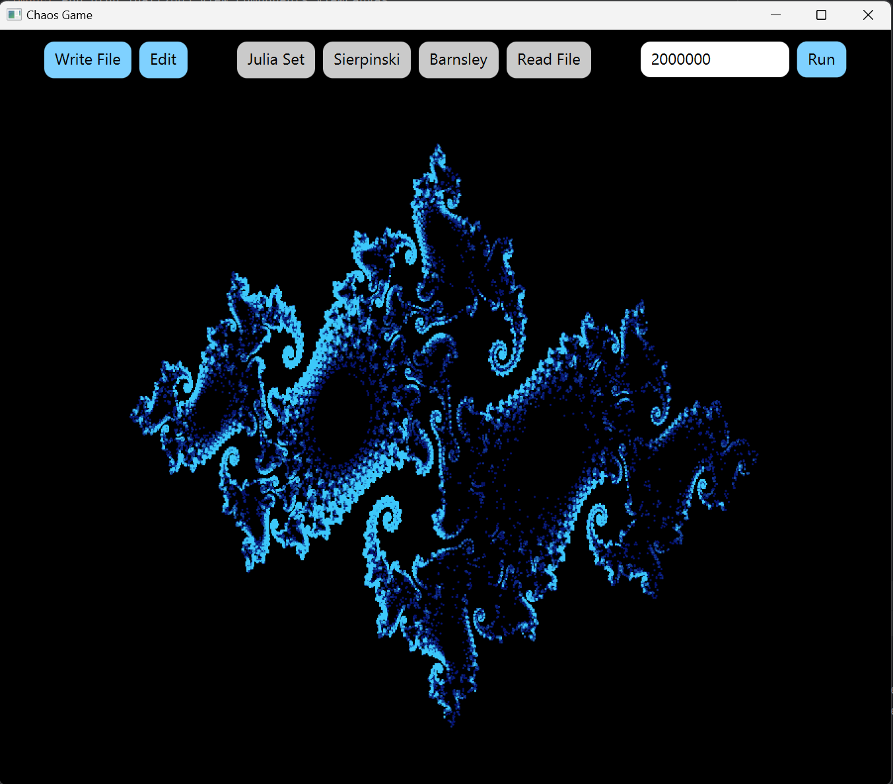
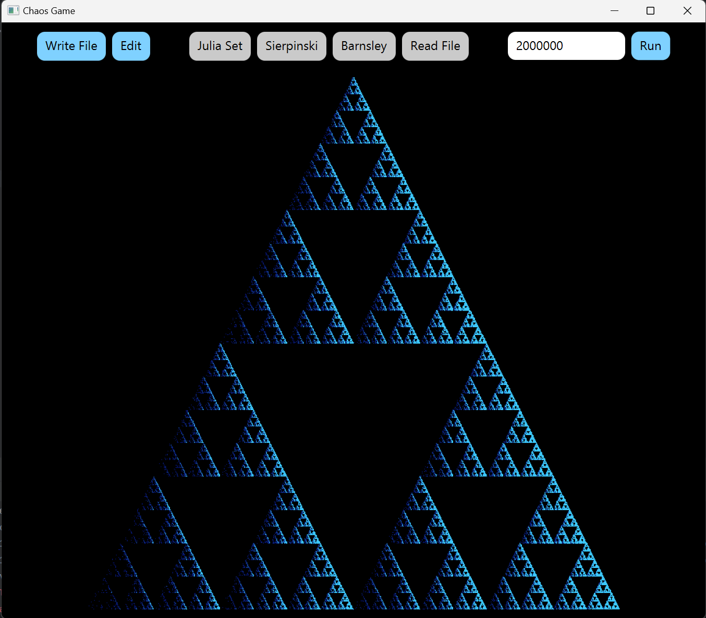

# Chaos game

This is a program for visualizing fractals generated by a Chaos game.  
You can choose from a couple of predefined fractals or read in a custom one from a file.  
The chosen chaos game description can be edited and saved to a file.  
The chaos game can be run with a chosen number of iterations, and will be animated gradually.

## How to run
Clone the repository to your local computer and make sure you have Java JDK installed.  
Either run the program in an IDE with integrated maven support or install maven to your computer.  
Then run the following command in the terminal in the project root directory or IDE terminal:  
mvn javafx:run

## Examples of fractals

